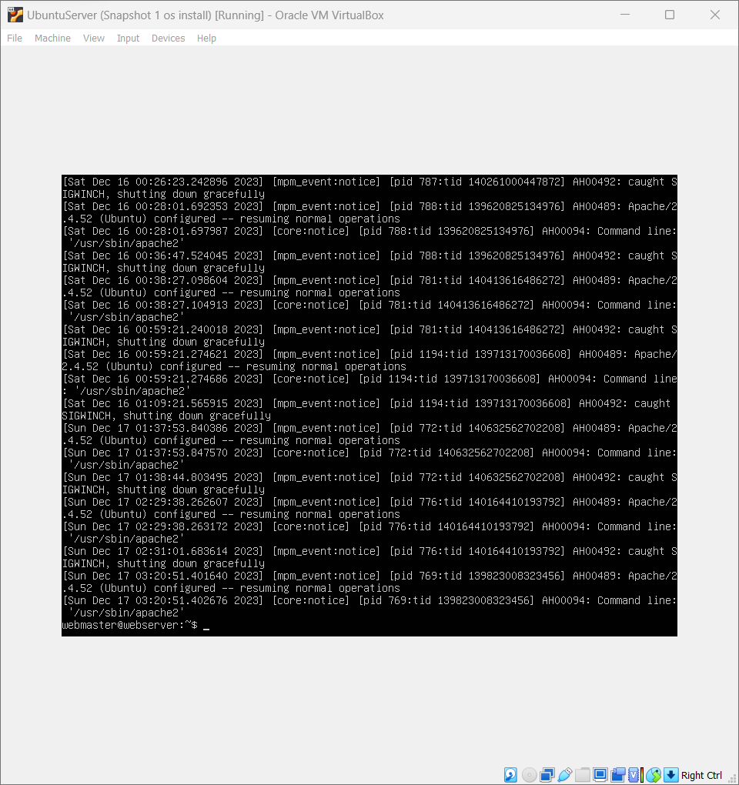

What are the server hardware specifications (virtual machine settings)? Take a screenshot - don’t type it!

What is Ubuntu server log in screen? Take screenshot - do not type it!

## What is the IP address of your Ubuntu Server Virtual Machine?
10.0.2.15

## How do you enable the Ubuntu Firewall?
sudo ufw enable

## How do you check if the Ubuntu Firewall is running?
sudo ufw status

## How do you disable the Ubuntu Firewall?
sudo ufw disable

## How do you add Apache to the Firewall?
sudo ufw allow 'Apache'

## What is the command you used to install Apache?
sudo apt install apache2 -y

## What is the command you use to check if Apache is running?
sudo systemctl status apache2 --no-pager

## What is the command you use to stop Apache?
sudo systemctl stop apache2 --no-pager

## What is the command you use to restart Apache?
sudo systemctl restart apache2 --no-pager

## What is the command used to test Apache configuration?
sudo apache2ctl configtest

## What is the command used to check the installed version of Apache? 

apache2 -v

## What are the most common commands to troubleshoot Apache errors? Provide a brief description of each command.
To inspect the state of the Apache processes on your system
***sudo systemctl status apache2.service -l --no-pager***

To inspect the systemd logs for Apache, you can use the journalctl command
***sudo journalctl -u apache2.service --since today --no-pager***

test your Apache configuration using the apachectl configtest command.
***sudo apachectl configtest***

To examine log files for errors 

***sudo tail -n 2 /var/log/apache2/error.log***
## Which are Apache Log Files, and what are they used for? Provide examples and screenshots.
***sudo tail -n 2 /var/log/apache2/error.log***
Error Log: This includes server faults, script errors, and requests for missing files.

***sudo tail -n 2 /var/log/apache2/access.log***
Access Log: records all requests received by the server. Each entry includes details like the client's IP address, request date/time, requested page, HTTP code, and more.
