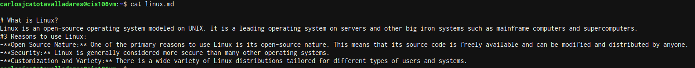
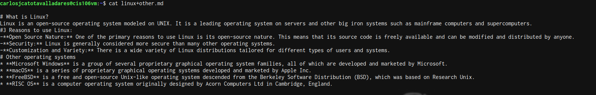
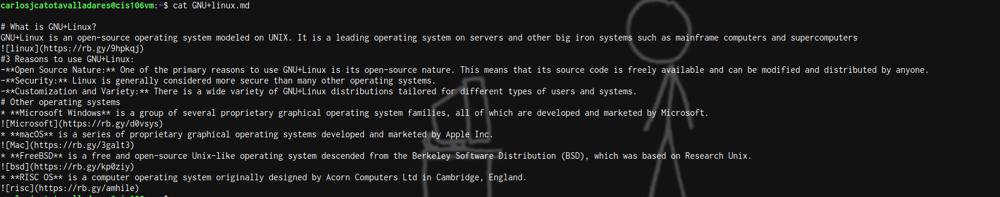

# Lab 8
## Linux.md 

[linux.md](https://github.com/CarlosCatota12/cis106/blob/main/Labs/lab8/linux.md) This is the link of the first file in my repo

## Linux+other.md

[linux+other.md](https://github.com/CarlosCatota12/cis106/blob/main/Labs/lab8/linux%2Bother.md) second link

## GNU+Linux.md

[GNU+Linux.md](https://github.com/CarlosCatota12/cis106/blob/main/Labs/lab8/GNU%2Blinux.md) last link