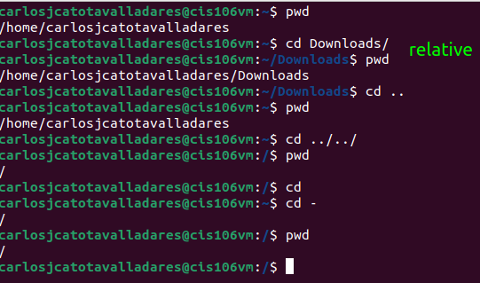
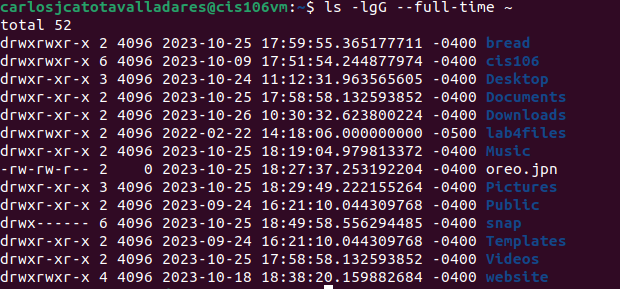
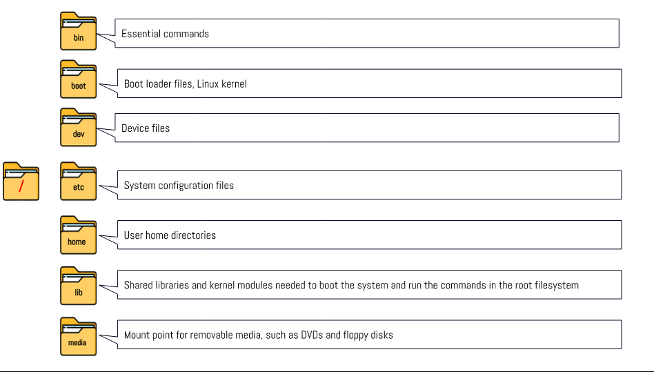
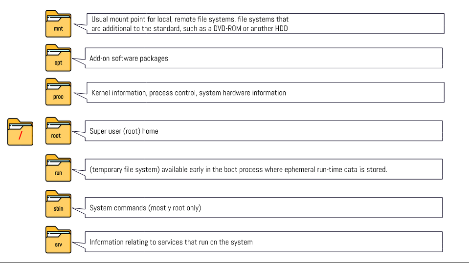
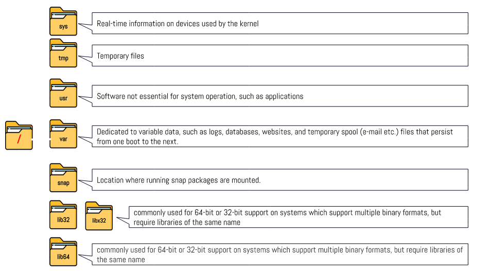

# Week report 4

## Practice for the presentation The Linux File system:
### Practice 1

### Practice 2

### Practice 3

## The Linux File System directories and their purpose:

## All the commands for navigating the filesystem:
| Command | What it does                                                                                         | Syntax                                 | Example                 |
| ------- | ---------------------------------------------------------------------------------------------------- | -------------------------------------- | ----------------------- |
| ls      | used foe viewing the content of a directory and for viewing details about the files and directories. | `ls` + `option` + `` directory to list | `ls -a ~/Downloads`     |
| cd      | change the current working directory                                                                 | `cd` + `destination`                   | `cd /home/$USER/Music/` |
| pwd     | display the current working directory                                                                | `pwd`                                  |`pwd`                   |

## Basic Terminology 
* **File System:** The way files are stored and organized.
* **Current directory:** The directory in a file system where a user or program is currently operating or interacting with files.
* **parent directory:** It Refers to the directory containing another directory.
* **the difference between your home directory and the home directory:** ***Your home directory*** is your personal directory for storing user-specific data, while ***the home directory*** often refers to the system-wide directory containing all user home directories on a multi-user system.
* **pathname:** it is text-based which indicates the location of the file in the filesystem.
* **relative path:** the location of a file starting from the current working directory or a directory that is located inside the current working directory
* **absolute path:**the location of a file starting a the root of the file system

