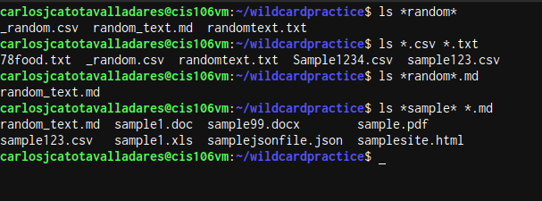
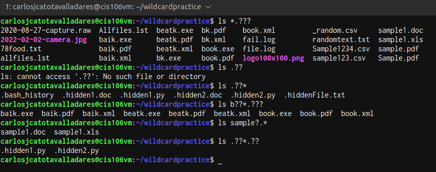
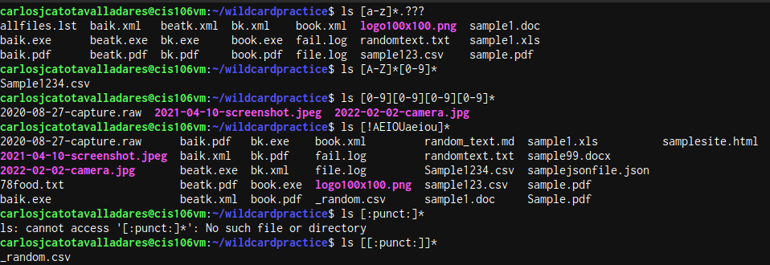

# Week Report 6 
## Wildcard
### * Wildcard
the * wildcard matches from 0 to any number of characters. 
  * Examples 
    * List all the mp3 files in a directory 
      * `ls *.mp3`
    * List all the Files that start with the word text
      * `ls text*`
    * remove all the Files that has the name carlos
      * `rm -r ~/*carlos*`
### ? Wildcard
the ? wildcard matches a single character. 
  * Examples 
    * list all the files that have 2 only characters in the extension 
      * `ls *.??`
    * list all the files that has only 1 character and are followed by the word homework in the name 
      * `ls ?homework*`
    * list all the files that only has 5 characters before the extension 
      * `ls ?????.*`
### [] Wilcard 
the [] wilcard match a single character in a range 
  * Examples 
    * list all the files that start with a number 
      * `ls [0-9]*`
    * list all the files whose name does not have a vowel before the file extension 
      * `ls *[!aeiou].*`
    * list all the files that start with upper case 
      * `ls [A-Z]*`
### Practice 5

### Practice 6

### Practice 7

### Brace Expansion 
Brace Expansion{} allows you to generate arbitrary strings to use with commands.
to use Brace expansion you need to use *{}* and separate each file with *,* non space 
  * exmaples 
    * create multiple directories in a singular command 
      * `mkdir -p docs/{homeworks,weekreports}/{week1,week2}`
    * rm multiple files in a single directory 
      * `rm docs/{kl.txt,music.mp3,teen.txt}`
    * copy multiple files at the same time 
      * `cp -r {kl.txt,lk.mp3} docs/`
